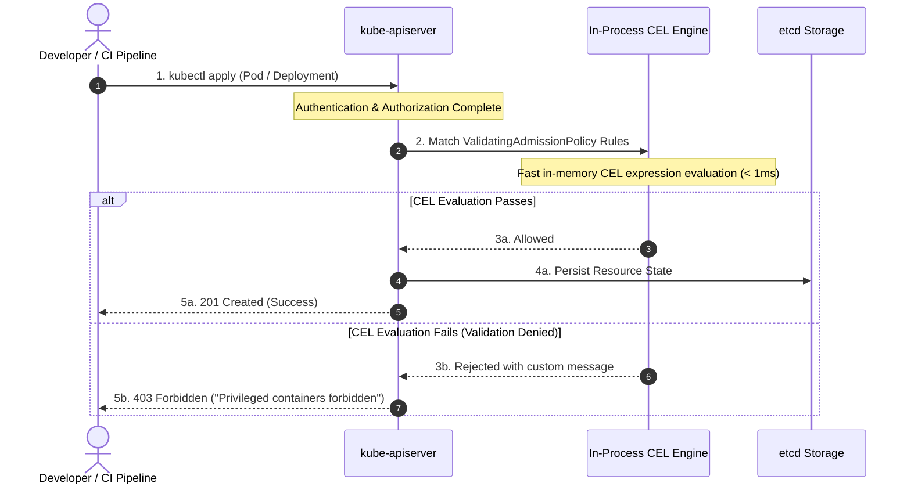



---

## 1. 개요: 웹훅 없는 내장 어드미션 컨트롤의 시대

Kubernetes 클러스터에서 보안 거버넌스와 리소스 검증을 구현할 때 오랫동안 표준으로 사용되던 방식은 **동적 어드미션 웹훅(Dynamic Admission Webhooks)**이었습니다. OPA Gatekeeper나 Kyverno와 같은 서드파티 컨트롤러는 뛰어난 정책 표현력을 제공했지만, 실제 프로덕션 환경에서는 다음과 같은 운영상의 치명적인 약점들을 안고 있었습니다:

1. **네트워크 지연 및 리소스 오버헤드**: 모든 API 요청이 외부 웹훅 Pod로 왕복(Roundtrip) 통신을 거쳐야 하므로 API 서버 처리 속도가 저하됩니다.
2. **단일 장애점(SPOF) 위험**: 웹훅 Pod가 OOMKilled되거나 네트워크 파티션이 발생할 경우, `failurePolicy: Fail` 설정으로 인해 클러스터 전체 리소스 생성이 마비되는 장애가 빈번히 발생했습니다.
3. **TLS 인증서 수명 주기 관리 부담**: API 서버와 웹훅 간의 mTLS 인증서 자동 갱신(cert-manager 등) 실패로 인한 인시던트가 빈번했습니다.

이러한 문제를 해결하기 위해 Kubernetes v1.26에서 알파로 도입되고 **v1.30에서 정식 일반 제공(GA)**된 기능이 바로 **ValidatingAdmissionPolicy (VAP)**입니다.

Google이 개발한 선언적 평가 엔진인 **Common Expression Language(CEL)**를 `kube-apiserver` 바이너리 내부에 직접 내장함으로써, 외부 웹훅 없이 메모리 내부에서 1ms 미만의 지연 시간으로 강력한 보안 가드레일을 강제할 수 있게 되었습니다.

---

## 2. 아키텍처 및 동작 원리

`ValidatingAdmissionPolicy`는 두 가지 핵심 리소스로 구성됩니다:
- **`ValidatingAdmissionPolicy`**: 어떤 리소스를 대상으로 어떤 CEL 규칙을 검증할지 선언하는 **정책 정의(Definition)**.
- **`ValidatingAdmissionPolicyBinding`**: 정의된 정책을 특정 네임스페이스, 환경, 사용자에게 매핑하고 위반 시 동작(Deny/Warn/Audit)을 지정하는 **바인딩(Binding)**.



### CEL 정책의 주요 내장 변수

CEL 평가 시 `kube-apiserver`가 제공하는 컨텍스트 변수는 다음과 같습니다:
- `object`: 생성/수정 요청된 최신 리소스 객체 (v1.Pod 등)
- `oldObject`: 수정(UPDATE) 시점의 기존 리소스 객체 (삭제/생성 시 null)
- `request`: 사용자, 네임스페이스, 작업 유형(CREATE/UPDATE) 등의 메타데이터
- `params`: 정책 바인딩과 연동된 파라미터 리소스 객체

---

## 3. 실무 핵심 보안 정책 레시피 (Production Policy Recipes)

### 레시피 1: 특권 컨테이너(Privileged) 및 위험 호스트 기능 차단

컨테이너 탈옥(Container Escape)의 가장 대표적인 통로인 `privileged: true`, `hostPID`, `hostNetwork`를 원천 차단하는 정책 정의입니다.

```yaml
# https://github.com/kubernetes/kubernetes/blob/master/staging/src/k8s.io/api/admissionregistration/v1/types.go
apiVersion: admissionregistration.k8s.io/v1
kind: ValidatingAdmissionPolicy
metadata:
  name: "disallow-privileged-and-host-access"
spec:
  failurePolicy: Fail
  matchConstraints:
    resourceRules:
      - apiGroups: [""]
        apiVersions: ["v1"]
        operations: ["CREATE", "UPDATE"]
        resources: ["pods"]
  validations:
    - expression: "!has(object.spec.hostNetwork) || object.spec.hostNetwork == false"
      message: "hostNetwork access is strictly prohibited."
    - expression: "!has(object.spec.hostPID) || object.spec.hostPID == false"
      message: "hostPID sharing is strictly prohibited."
    - expression: >-
        object.spec.containers.all(c, !has(c.securityContext) || !has(c.securityContext.privileged) || c.securityContext.privileged == false)
      message: "Privileged containers are not allowed in production."
```

정의된 정책을 프로덕션 및 스테이징 네임스페이스에 바인딩합니다:

```yaml
# https://kubernetes.io/docs/reference/access-authn-authz/validating-admission-policy/
apiVersion: admissionregistration.k8s.io/v1
kind: ValidatingAdmissionPolicyBinding
metadata:
  name: "disallow-privileged-binding"
spec:
  policyName: "disallow-privileged-and-host-access"
  validationActions: [Deny, Warn]
  matchResources:
    namespaceSelector:
      matchExpressions:
        - key: environment
          operator: In
          values: ["production", "staging"]
```

### 레시피 2: 사내 승인된 프라이빗 레지스트리 이미지 강제 & latest 태그 금지

공급망 공격(Supply Chain Attack)을 방어하기 위해 외부 퍼블릭 레지스트리의 직접 다운로드를 막고 사내 보안 검증을 통과한 레지스트리만 허용합니다.

```yaml
# https://github.com/kubernetes/enhancements/tree/master/keps/sig-api-machinery/3488-cel-admission-control
apiVersion: admissionregistration.k8s.io/v1
kind: ValidatingAdmissionPolicy
metadata:
  name: "enforce-trusted-registry"
spec:
  failurePolicy: Fail
  matchConstraints:
    resourceRules:
      - apiGroups: [""]
        apiVersions: ["v1"]
        operations: ["CREATE", "UPDATE"]
        resources: ["pods"]
  validations:
    - expression: >-
        object.spec.containers.all(c, c.image.startsWith("123456789012.dkr.ecr.ap-northeast-2.amazonaws.com/") || c.image.startsWith("gcr.io/twodragon-security/"))
      message: "All container images must originate from trusted enterprise registry."
    - expression: >-
        object.spec.containers.all(c, !c.image.endsWith(":latest") && c.image.contains(":"))
      message: "Floating image tag ':latest' is prohibited. Specify immutable semantic tag or sha256 digest."
```

### 레시피 3: 리소스 Limit/Request 및 읽기 전용 루트 파일시스템 필수화

컨테이너가 손상되었을 때 공격자가 악성 바이너리를 다운로드하여 실행하지 못하도록 `readOnlyRootFilesystem: true`를 강제하고 노드 자원 고갈을 방지합니다.

```yaml
# https://kubernetes.io/docs/reference/access-authn-authz/validating-admission-policy/
apiVersion: admissionregistration.k8s.io/v1
kind: ValidatingAdmissionPolicy
metadata:
  name: "enforce-workload-hardening"
spec:
  failurePolicy: Fail
  matchConstraints:
    resourceRules:
      - apiGroups: [""]
        apiVersions: ["v1"]
        operations: ["CREATE", "UPDATE"]
        resources: ["pods"]
  validations:
    - expression: >-
        object.spec.containers.all(c, has(c.securityContext) && has(c.securityContext.readOnlyRootFilesystem) && c.securityContext.readOnlyRootFilesystem == true)
      message: "Containers must run with readOnlyRootFilesystem set to true."
    - expression: >-
        object.spec.containers.all(c, has(c.resources) && has(c.resources.limits) && has(c.resources.limits.cpu) && has(c.resources.limits.memory))
      message: "CPU and Memory resource limits must be explicitly declared."
```

---

## 4. 도구별 종합 비교: VAP vs Kyverno vs OPA Gatekeeper

| 평가 항목 | Kubernetes ValidatingAdmissionPolicy | Kyverno (v1.12+) | OPA Gatekeeper (v3.16+) |
|---|---|---|---|
| **실행 위치** | `kube-apiserver` 인프로세스 | 독립 Pod (Webhook) | 독립 Pod (Webhook) |
| **평가 지연시간(Latency)** | **< 1ms (초고속 인메모리)** | 10 ~ 50ms (네트워크 왕복) | 15 ~ 70ms (네트워크 왕복) |
| **장애 시 영향도** | **SPOF 없음 (API 서버 내장)** | 웹훅 다운 시 클러스터 마비 위험 | 웹훅 다운 시 클러스터 마비 위험 |
| **인증서 관리** | **완전 불필요 (내장 엔진)** | cert-manager 연동 필요 | cert-manager 연동 필요 |
| **정책 언어** | **CEL (Common Expression Language)** | YAML 선언형 DSL | Rego (선언형 질의어) |
| **리소스 변이(Mutation)** | Kubernetes v1.32+ MutatingAdmissionPolicy 도입 예정 | 강력 지원 | 지원 |
| **외부 데이터 조회** | 제한적 (파라미터 CRD 연동) | ConfigMap / API 조회 지원 | 클러스터 캐싱 지원 |
| **적합한 유즈케이스** | **핵심 보안 가드레일, 리소스 규격 강제** | 복잡한 변이 및 생성 자동화 | 엔터프라이즈 멀티 클라우드 규제 |

---

## 5. 단계적 도입 및 마이그레이션 전략

프로덕션 클러스터에 정책을 일괄 적용(Deny)할 경우 예기치 못한 애플리케이션 배포 중단이 발생할 수 있습니다. Kubernetes VAP는 `validationActions` 필드를 통해 완벽한 3단계 카나리 롤아웃을 지원합니다.

```
[1단계: 감사 (Audit)] ──► [2단계: 경고 (Warn)] ──► [3단계: 차단 (Deny)]
  - API 이벤트 로깅         - 개발자 콘솔 경고         - 위반 요청 원천 차단
  - 기존 워크로드 분석       - 파이프라인 알림          - 무결점 가드레일 완성
```

1. **1단계 (Audit)**: `validationActions: [Audit]` 설정으로 API 서버 감사 로그에만 위반 사항을 기록하여 기존 배포된 파드들의 영향도를 분석합니다.
2. **2단계 (Warn)**: `validationActions: [Warn]`으로 변경하여 개발자가 `kubectl` 또는 CI/CD 파이프라인에서 배포 시 터미널 경고 메시지를 확인하고 사전 수정하도록 유도합니다.
3. **3단계 (Deny)**: 최종적으로 `validationActions: [Deny]`를 설정하여 위반 리소스 생성을 원천 차단합니다.

---

## 6. 실무 적용 및 운영 체크리스트 (Actionable Checklist)

- [ ] **클러스터 버전 확인**: Kubernetes 버전이 v1.30 이상인지 확인합니다 (`kubectl version`).
- [ ] **내장 API 활성화 검증**: `admissionregistration.k8s.io/v1` 그룹 내 `ValidatingAdmissionPolicy`가 활성화되어 있는지 확인합니다.
- [ ] **핵심 가드레일 수립**: 특권 파드(`privileged`), 호스트 네임스페이스, 이미지 태그(`latest`) 차단 정책을 배포합니다.
- [ ] **네임스페이스 바인딩 격리**: `kube-system` 등 클러스터 핵심 시스템 네임스페이스는 예외 처리되도록 `namespaceSelector`를 구성합니다.
- [ ] **감사(Audit) 모드 선행**: 운영 환경 배포 전 최소 1주일간 `validationActions: [Warn, Audit]`으로 가동하여 오탐(False Positive)을 필터링합니다.
- [ ] **레거시 웹훅 단계적 축소**: 단순 검증 목적의 무거운 OPA/Kyverno 웹훅을 VAP로 마이그레이션하여 API 서버 부하를 최소화합니다.
