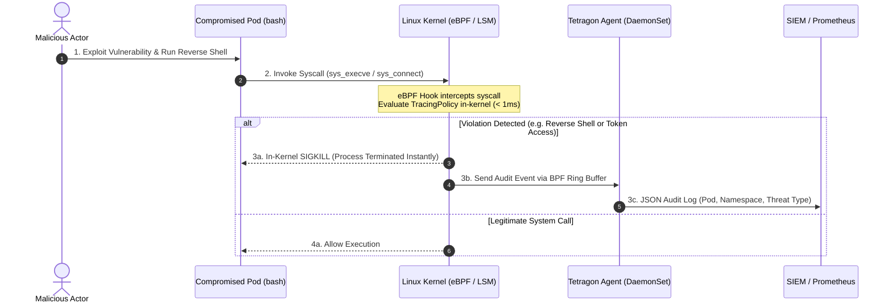



---

## Executive Summary

- **배경 및 과제**: 전통적인 컨테이너 런타임 보안 도구(Auditd, Sysdig, Falco)는 유저스페이스 데몬으로 이벤트를 전달한 후 사후 경고(Alert)를 발송하므로, 공격자가 수 밀리초(ms) 내에 메모리 덤프나 권한 상승을 수행하는 타임 투 콤프로마이즈(TTC)를 능동적으로 차단하기 어려웠습니다.
- **핵심 아키텍처 전략**: eBPF(extended Berkeley Packet Filter) 기반 인커널(In-Kernel) 엔진인 Cilium Tetragon을 도입하여, 커널 계층에서 kprobe 및 LSM 훅을 통해 시스템 콜 실행 즉시 정책을 검증하고 악성 프로세스를 `SIGKILL`로 즉각 종료합니다.
- **도입 기대 효과**: 호스트 오버헤드를 1% 미만으로 유지하면서 컨테이너 탈옥(Escape), 리버스 쉘(Reverse Shell), 민감 파일 접근을 0ms 레이턴시로 차단하고, 쿠버네티스 CRD(`TracingPolicy`) 기반의 선언적 보안 파이프라인을 완성합니다.

---

## 위험 스코어카드 (Threat & Risk Scorecard)

| 위협 카테고리 | 위험도 수준 | 영향도(Impact) | 발생 가능성 | 주요 완화 전략 |
|---|---|---|---|---|
| **컨테이너 탈옥 (Container Escape)** | **Critical (치명적)** | 호스트 노드 커널 장악 및 클러스터 침해 | 높음 (High) | 커널 LSM 훅 기반 `setns`, `unshare` 시스템 콜 차단 |
| **리버스 쉘 (Reverse Shell) 수립** | **Critical (치명적)** | 원격 공격자 C2 제어권 획득 | 높음 (High) | 소켓 연결 직후 대화형 쉘(`sh`, `bash`) 생성 시 `SIGKILL` |
| **쿠버네티스 서비스 토큰 탈취** | **High (높음)** | API Server 대상 비인가 수평 이동 | 높음 (High) | `/var/run/secrets/` 경로 파일 읽기 차단 정책 적용 |
| **사후 탐지(Alert-only) 한계** | **High (높음)** | 데이터 유출 후 경고 발생으로 피해 방지 불가 | 높음 (High) | 유저스페이스 비동기 알림 대신 인커널 즉시 차단 전환 |
| **에이전트 과부하 및 커널 크래시** | **Medium (중간)** | 노드 성능 저하 및 운영 서비스 불안정 | 낮음 (Low) | eBPF Verifier 안전성 보증 및 eBPF Map 메모리 제한 |

---

## 1. 개요: eBPF와 쿠버네티스 런타임 보안의 진화

### 1.1 전통적 커널 모듈(LSM) 및 ptrace 방식의 한계
쿠버네티스 환경에서 파드와 컨테이너는 기본적으로 리눅스 네임스페이스와 cgroups를 통해 격리되지만, 호스트 OS의 **단일 리눅스 커널을 공유**합니다. 컨테이너 내부에서 실행되는 모든 바이너리는 결국 커널 시스템 콜(syscall)을 호출하므로, 런타임 보안의 성패는 시스템 콜을 얼마나 빠르고 안전하게 감시하느냐에 달려 있습니다.

전통적인 감시 방식은 다음과 같은 치명적 단점을 가졌습니다:
1. **ptrace / LD_PRELOAD**: 디버거 메커니즘을 사용하므로 프로세스 실행 속도가 50% 이상 저하되며, 정교한 공격자에 의해 손쉽게 우회(Bypass)됩니다.
2. **Auditd / Falco (Ring Buffer 통신)**: 커널에서 이벤트를 캡처하여 유저스페이스 데몬으로 전송한 후 정책을 평가합니다. 이벤트 큐가 밀릴 경우 패킷 드롭이 발생하며, 탐지 시점에는 이미 공격 스크립트가 실행을 완료한 상태입니다.
3. **커널 모듈(LKM) 직접 로드**: 커널 패닉(Kernel Panic) 시 전체 노드가 다운되는 고위험성을 내포합니다.

### 1.2 eBPF와 Tetragon 아키텍처의 부상
이러한 문제를 해결하기 위해 등장한 혁신 기술이 바로 **eBPF(extended Berkeley Packet Filter)**입니다. 리눅스 커널을 수정하거나 모듈을 추가하지 않고도 샌드박스화된 eBPF 바이트코드를 커널 내부에서 안전하게 실행할 수 있습니다.

Cilium 프로젝트에서 개발한 **Tetragon**은 eBPF의 능력을 극대화하여 다음과 같은 차세대 보안 아키텍처를 제공합니다:
- **Zero-Latency In-Kernel Enforcement**: 유저스페이스로 콘텍스트 스위칭을 하지 않고 커널 내부에서 즉시 위반 프로세스를 사살(`SIGKILL`).
- **Kubernetes 네이티브 메타데이터 인지**: 컨테이너 ID, 네임스페이스, 파드 이름, 라벨 정보를 eBPF 맵에서 실시간 매핑.
- **선언적 CRD 관리**: `kubectl`을 통해 보안 정책을 배포하고 버전 관리할 수 있는 `TracingPolicy` 제공.

---

## 2. Tetragon 아키텍처 및 커널 레벨 동작 메커니즘



### 2.1 kprobes, tracepoints, LSM 훅 기반 정밀 감지
Tetragon은 리눅스 커널의 다양한 진입점에 eBPF 프로그램을 부착합니다:
- **kprobes / kretprobes**: 함수 진입 및 반환 시점의 인자(Arguments)와 리턴값을 분석.
- **Tracepoints**: 커널 내부의 안정적인 정적 계측 포인트 활용.
- **LSM(Linux Security Module) Hooks**: 시스템 콜 실행 직전 접근 권한을 능동 통제(`bpf_lsm`).

### 2.2 유저스페이스 지연 없는 커널 내 실시간 SIGKILL 차단
기존 솔루션이 알림(Audit) 중심이었다면, Tetragon은 위협 감지 시 커널 헬퍼 함수(`bpf_send_signal(SIGKILL)`)를 직접 호출하여 악성 프로세스가 첫 번째 I/O를 수행하기 전에 물리적으로 종료합니다.

---

## 3. 프로덕션 TracingPolicy 보안 정책 레시피

### 3.1 레시피 1: 네임스페이스 서비스 계정 토큰 탈취 차단
공격자가 침투 후 가장 먼저 시도하는 쿠버네티스 서비스 어카운트 토큰 읽기를 커널 레벨에서 차단합니다.

```yaml
# https://tetragon.io/docs/concepts/tracing-policy/
apiVersion: cilium.io/v1alpha1
kind: TracingPolicy
metadata:
  name: "block-k8s-token-theft"
spec:
  kprobes:
    - call: "sys_openat"
      syscall: true
      args:
        - index: 1
          type: "string"
      selectors:
        - matchArgs:
            - index: 1
              operator: "Prefix"
              values: ["/var/run/secrets/kubernetes.io/serviceaccount/token"]
          matchActions:
            - action: Sigkill
```

### 3.2 레시피 2: 리버스 쉘 및 비인가 대화형 쉘 실행 차단
웹 애플리케이션 파드에서 허가되지 않은 대화형 쉘(`/bin/sh`, `/bin/bash`, `nc`, `python`) 실행을 즉시 사살합니다.

```yaml
# https://tetragon.io/docs/concepts/tracing-policy/
apiVersion: cilium.io/v1alpha1
kind: TracingPolicyNamespaced
metadata:
  name: "block-interactive-shell"
  namespace: "production"
spec:
  kprobes:
    - call: "sys_execve"
      syscall: true
      args:
        - index: 0
          type: "string"
      selectors:
        - matchArgs:
            - index: 0
              operator: "Postfix"
              values: ["/sh", "/bash", "/nc", "/zsh"]
          matchActions:
            - action: Sigkill
```

### 3.3 레시피 3: 커널 네임스페이스 탈옥(unshare, setns) 차단
호스트 노드로 권한을 승격하려는 네임스페이스 조작 시스템 콜을 인커널에서 거부합니다.

```yaml
# https://tetragon.io/docs/concepts/tracing-policy/
apiVersion: cilium.io/v1alpha1
kind: TracingPolicy
metadata:
  name: "prevent-namespace-escape"
spec:
  kprobes:
    - call: "sys_setns"
      syscall: true
      selectors:
        - matchActions:
            - action: Sigkill
    - call: "sys_unshare"
      syscall: true
      selectors:
        - matchActions:
            - action: Sigkill
```

---

## 4. 런타임 보안 기술 비교 분석: Falco vs AppArmor vs Tetragon

### 4.1 핵심 성능 및 차단 능력 비교 매트릭스

| 평가 지표 | Falco (eBPF / Kernel Module) | AppArmor / SELinux | Cilium Tetragon (eBPF LSM) | 엔터프라이즈 권장 가이드 |
|---|---|---|---|---|
| **차단 방식** | 사후 경고 중심 (Audit-First) | 사전 차단 (Inline MAC) | **인커널 즉시 사살 (SIGKILL Enforcement)** | **Tetragon 권장** |
| **차단 레이턴시** | 5ms ~ 100ms (유저스페이스 지연) | 0ms (커널 인라인) | **0ms (eBPF 즉각 중단)** | **Tetragon / AppArmor** |
| **쿠버네티스 컨텍스트 인지** | 유저스페이스 데몬에서 비동기 매핑 | 쿠버네티스 메타데이터 인지 불가 | **eBPF 맵 기반 실시간 인커널 매핑** | **Tetragon 압도적 우위** |
| **정책 정의 방식** | YAML / 자체 룰 문법 | 호스트 프로파일 텍스트 파일 | **Kubernetes CRD (`TracingPolicy`)** | **GitOps 일원화 지원** |
| **CPU/메모리 오버헤드** | 이벤트 폭주 시 10~25% 증가 | 1% 미만 | **1~3% (최소화된 커널 훅)** | **대규모 클러스터 최적** |
| **시스템 콜 인자 필터링** | 지원 (문자열 정합) | 파일 경로 기반 한정 | **시스템 콜 진입/반환 정밀 인자 검증** | **심층 방어 적합** |

### 4.2 계층별 심층 런타임 방어 모델
1. **정적 어드미션 계층**: 배포 전 `ValidatingAdmissionPolicy(VAP)`로 파드 스펙 검증.
2. **인커널 런타임 계층**: 프로세스 실행 단계에서 `Tetragon` eBPF 훅을 통해 비인가 시스템 콜 차단.
3. **네트워크 보안 계층**: Cilium CNI 기반의 L3/L4/L7 네트워크 폴리시로 Egress 격리.

---

## 5. 프로덕션 운영 및 거버넌스 체크리스트 (Actionable Checklist)

### 5.1 엔터프라이즈 배포 체크리스트
- [ ] **리눅스 커널 버전 점검**: 노드 커널 버전이 BTF(BPF Type Format) 지원 5.4+ 이상인지 확인.
- [ ] **Helm 차트 배포**: Cilium 공식 레포지토리를 통해 `tetragon` DaemonSet 배포 (`helm install tetragon cilium/tetragon`).
- [ ] **단계적 정책 적용**: 신규 `TracingPolicy` 적용 시 `matchActions`를 먼저 비워두고 감사 로그(Audit) 검증 후 `Sigkill` 활성화.
- [ ] **고위험 파드 격리**: 데이터베이스, 금융 결제 처리 네임스페이스에 토큰 탈취 방지 정책 우선 적용.
- [ ] **SIEM / Fluentbit 파이프라인 연동**: `/var/run/cilium/tetragon/tetragon.log` JSON 스트림 중앙 집계.

### 5.2 지속적 메트릭 및 대시보드 모니터링
Prometheus 메트릭(`tetragon_events_total`, `tetragon_policy_filter_events_total`)을 연동하여 정책 위반 차단 이벤트를 Grafana 대시보드에 실시간 시각화합니다.

---

## 6. 관련 포스트 및 참고 자료 (Cross References)

- 쿠버네티스 인프로세스 정책 통제: 
- AI 에이전트 MCP 보안 아키텍처: 
- AWS 다계정 제로 트러스트 거버넌스: 
