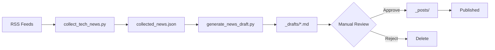

# Daily Tech News Collection System

매일 자동으로 기술/보안 뉴스를 수집하고 블로그 초안을 생성하는 시스템입니다.

## 📋 개요

```
┌──────────────────┐     ┌──────────────────┐     ┌──────────────────┐
│   RSS Feeds      │────▶│  collect_tech    │────▶│  _data/          │
│   (15+ sources)  │     │  _news.py        │     │  collected_news  │
└──────────────────┘     └──────────────────┘     │  .json           │
                                                   └────────┬─────────┘
                                                            │
                                                            ▼
┌──────────────────┐     ┌──────────────────┐     ┌──────────────────┐
│   _posts/        │◀────│  Manual Review   │◀────│  generate_news   │
│   (published)    │     │  & Edit          │     │  _draft.py       │
└──────────────────┘     └──────────────────┘     └──────────────────┘
                                                            │
                                                            ▼
                                                   ┌──────────────────┐
                                                   │   _drafts/       │
                                                   │   (auto-created) │
                                                   └──────────────────┘
```

## 🔧 설치

```bash
# 의존성 설치
pip install feedparser requests beautifulsoup4 python-frontmatter google-generativeai PyYAML
```

## 📰 뉴스 소스

### 한국어 소스
| 소스 | 카테고리 | 설명 |
|------|----------|------|
| GeekNews | tech | 한국 기술 뉴스 큐레이션 |
| AWS Korea Blog | cloud | AWS 한국 기술 블로그 |

### 보안 뉴스
| 소스 | 카테고리 | 설명 |
|------|----------|------|
| AWS Security Blog | security | AWS 보안 공식 블로그 |
| Microsoft Security Blog | security | MS 보안 공식 블로그 |
| CISA | security | 미국 사이버보안 기관 |
| Datadog Security Labs | security | Datadog 보안 연구 |
| The Hacker News | security | 보안 뉴스 미디어 |
| Krebs on Security | security | 보안 전문가 블로그 |
| OWASP Blog | security | 웹 보안 재단 |

### 클라우드 & DevOps
| 소스 | 카테고리 | 설명 |
|------|----------|------|
| AWS Blog | cloud | AWS 공식 블로그 |
| Google Cloud Blog | cloud | GCP 공식 블로그 |
| Azure Blog | cloud | Azure 공식 블로그 |
| Kubernetes Blog | kubernetes | K8s 공식 블로그 |
| CNCF Blog | devops | CNCF 공식 블로그 |

### 기술 뉴스
| 소스 | 카테고리 | 설명 |
|------|----------|------|
| Hacker News | tech | YC 기술 뉴스 커뮤니티 |

## 🚀 사용법

### 1. 뉴스 수집

```bash
# 모든 소스에서 최근 24시간 뉴스 수집
python3 scripts/collect_tech_news.py

# 특정 소스만 수집
python3 scripts/collect_tech_news.py --sources aws,gcp,geeknews

# 최근 48시간 뉴스 수집
python3 scripts/collect_tech_news.py --hours 48

# 이미 처리된 뉴스 제외
python3 scripts/collect_tech_news.py --filter-processed

# 사용 가능한 소스 목록
python3 scripts/collect_tech_news.py --list-sources
```

### 2. 초안 생성

```bash
# 기본 초안 생성 (AI 요약 없음)
python3 scripts/generate_news_draft.py

# AI 요약 사용 (Gemini API 필요)
export GEMINI_API_KEY="your-api-key"
python3 scripts/generate_news_draft.py --use-ai

# 최대 5개만 생성
python3 scripts/generate_news_draft.py --max-posts 5

# 특정 카테고리만
python3 scripts/generate_news_draft.py --category security

# Dry-run (실제 파일 생성 안함)
python3 scripts/generate_news_draft.py --dry-run
```

### 3. 초안 검토 및 게시

1. `_drafts/` 폴더에서 생성된 초안 확인
2. 내용 검토 및 수정
3. 필요시 이미지 추가
4. `draft: true` 제거
5. `_posts/` 폴더로 이동
6. Git commit & push

## ⚙️ GitHub Actions

### 자동 실행
- **스케줄**: 매일 오전 9시 (KST)
- **워크플로우**: `.github/workflows/daily-news.yml`
- **게이트 변수**: `DAILY_NEWS_SCHEDULE=false` 설정 시 스케줄 실행 중지

### AI BlogWatcher 자동 발행
- **워크플로우**: `.github/workflows/ai-blogwatcher.yml`
- **트리거**: `repository_dispatch` (`ai_blogwatcher`) 또는 수동 실행
- **스케줄**: UTC 18:00 (KST 03:00), `AI_BLOGWATCHER_SCHEDULE=true`일 때만 동작

#### BlogWatcher payload format (권장)

```json
{
  "schema_version": "1.0",
  "collected_at": "2026-02-18T00:00:00Z",
  "items": [
    {
      "id": "source:hash",
      "title": "...",
      "url": "https://...",
      "summary": "...",
      "published": "2026-02-18T00:00:00Z",
      "source": "thehackernews",
      "source_name": "The Hacker News",
      "category": "security"
    }
  ]
}
```

#### repository_dispatch example

```json
{
  "event_type": "ai_blogwatcher",
  "client_payload": {
    "mode": "security",
    "use_ai": "none",
    "run_checks": "true",
    "collected_news_json": "{...payload json string...}"
  }
}
```

지원 입력 (client_payload):
- `collected_news_json`: 위 payload JSON 문자열
- `collected_news_url`: payload JSON URL
- `hours`, `max_news`, `mode`, `dry_run`, `force_publish`, `use_ai`, `run_checks`

### 수동 실행
1. GitHub 저장소의 Actions 탭 이동
2. "Daily Tech News Collection" 선택
3. "Run workflow" 클릭
4. 파라미터 설정:
   - `hours`: 수집 시간 범위 (기본: 24)
   - `sources`: 수집할 소스 (비워두면 전체)
   - `use_ai`: AI 요약 사용 여부 (기본: true)
   - `max_posts`: 최대 생성 개수 (기본: 10)

### 결과
- 새 초안이 있으면 자동으로 PR 생성
- PR 제목: `📰 Daily Tech News Drafts - {run_number}`
- 브랜치: `drafts/daily-news-{run_number}`

## 🔑 필요한 Secrets

| Secret | 설명 | 필수 |
|--------|------|------|
| `GEMINI_API_KEY` | Gemini API 키 (AI 요약용) | 선택 |

## 📁 파일 구조

```
tech-blog/
├── scripts/
│   ├── collect_tech_news.py    # 뉴스 수집 스크립트
│   ├── generate_news_draft.py  # 초안 생성 스크립트
│   ├── normalize_blogwatcher_payload.py # BlogWatcher payload 정규화
│   └── README_DAILY_NEWS.md    # 이 문서
├── _data/
│   ├── collected_news.json     # 수집된 뉴스 데이터
│   └── processed_news_ids.json # 처리된 뉴스 ID 목록
├── _drafts/
│   └── *.md                    # 생성된 초안
└── .github/workflows/
    └── daily-news.yml          # GitHub Actions 워크플로우
```

## 🔄 워크플로우



## 📊 뉴스 소스 추가하기

`scripts/collect_tech_news.py`의 `NEWS_SOURCES` 딕셔너리에 새 소스 추가:

```python
NEWS_SOURCES = {
    # ...
    "new_source": {
        "name": "New Source Name",
        "url": "https://example.com/",
        "feed_url": "https://example.com/rss.xml",
        "category": "security",  # security, cloud, tech, kubernetes, devops
        "language": "en",        # en, ko
        "priority": 1,           # 1=높음, 2=보통, 3=낮음
    },
}
```

## ⚠️ 주의사항

1. **API 사용량**: Gemini API는 무료 할당량이 있으므로 주의
2. **저작권**: 원문 링크와 출처를 항상 명시
3. **검토 필수**: 자동 생성된 초안은 반드시 검토 후 게시
4. **중복 방지**: `processed_news_ids.json`으로 중복 수집 방지

## 🐛 문제 해결

### RSS 피드 오류
```bash
# 특정 소스의 피드 상태 확인
python3 -c "
import feedparser
feed = feedparser.parse('https://news.hada.io/rss')
print(f'Entries: {len(feed.entries)}')
print(f'Error: {feed.bozo_exception if feed.bozo else None}')
"
```

### API 키 문제
```bash
# Gemini API 키 확인
echo $GEMINI_API_KEY

# API 테스트
python3 -c "
import os
import google.generativeai as genai
genai.configure(api_key=os.getenv('GEMINI_API_KEY'))
model = genai.GenerativeModel('gemini-1.5-flash')
print(model.generate_content('Hello').text)
"
```

## 📝 라이선스

이 스크립트는 tech-blog 프로젝트의 일부입니다.
